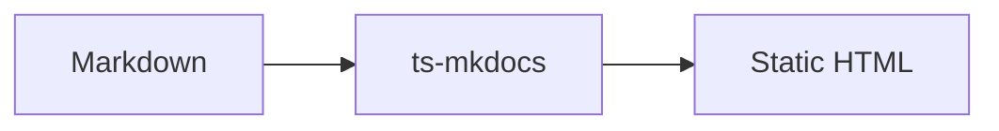
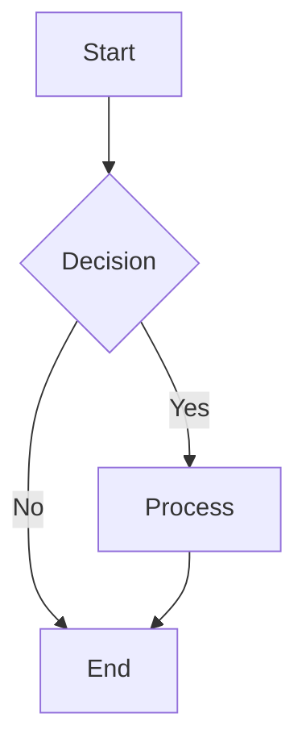
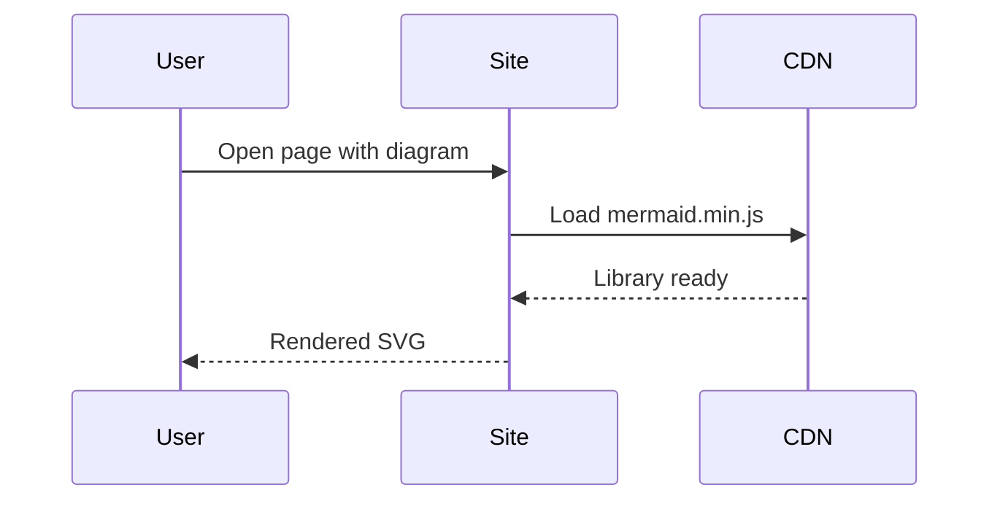
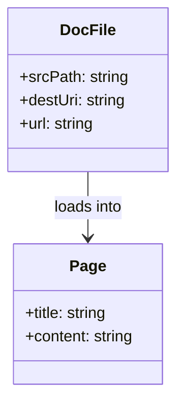
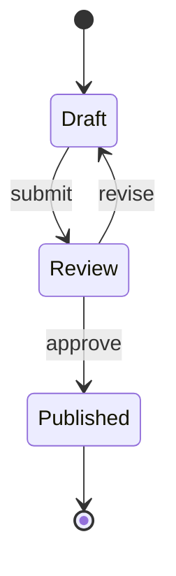
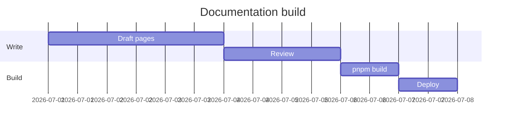
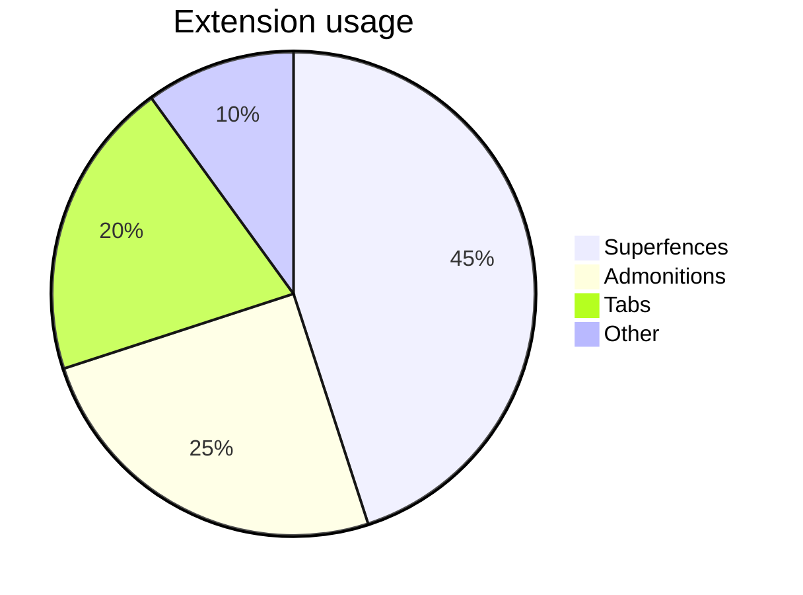

# Mermaid

ts-mkdocs renders [Mermaid](https://mermaid.js.org/) diagrams from ` ```mermaid ` code fences when `md.fences` is enabled (included by default). The library is loaded from a CDN at build time — no extra `extra_javascript` wiring is required.

> https://mermaid.js.org/intro/getting-started.html

## Configuration

Configure Mermaid under the `mermaid` key inside `md.fences`:

```yaml
markdown_extensions:
  - md.fences:
      mermaid:
        version: "10.9.3"
        cdn:
          base: https://cdn.jsdelivr.net/npm/mermaid@10.9.3/dist
        theme: auto
```

### CDN

`cdn.base` is expanded automatically into:

| Asset | Resolved URL |
|-------|--------------|
| JavaScript | `{base}/mermaid.min.js` |

You can also override the script URL directly:

```yaml
markdown_extensions:
  - md.fences:
      mermaid:
        cdn:
          javascript: https://cdn.example.com/mermaid.min.js
```

If `cdn` is omitted entirely, ts-mkdocs falls back to jsDelivr defaults derived from `version`.

### Theme and diagram options

```yaml
markdown_extensions:
  - md.fences:
      mermaid:
        theme: auto          # auto | default | dark | forest | neutral | base | null
        securityLevel: strict
        themeVariables:
          primaryColor: "#4f46e5"
        flowchart:
          curve: basis
          useMaxWidth: true
        sequence:
          actorMargin: 80
        gantt:
          barHeight: 24
```

When `theme` is `auto` (default), diagrams follow the site light/dark palette.

### All options

| Option | Default | Description |
|--------|---------|-------------|
| `version` | `10.9.3` | Package version for built-in CDN defaults |
| `cdn.base` | — | Base URL for default asset path (`mermaid.min.js`) |
| `cdn.javascript` | jsDelivr Mermaid JS | Full main script URL override |
| `theme` | `auto` | Mermaid theme; `auto` follows site light/dark mode |
| `themeVariables` | — | Custom theme color variables |
| `securityLevel` | — | `strict`, `loose`, `antiscript`, or `sandbox` |
| `flowchart` | — | Flowchart options: `curve`, `useMaxWidth`, `htmlLabels`, `diagramPadding` |
| `sequence` | — | Sequence diagram layout options |
| `gantt` | — | Gantt chart layout options |

See also the [Configuration](../../guide/configuration.md#mermaid-diagrams) reference page.

## Writing diagrams

Use a fenced code block with the `mermaid` language:

````markdown

````

### Flowchart



### Sequence diagram



### Class diagram



### State diagram



### Gantt chart



### Pie chart



## In admonitions

Mermaid blocks work inside admonitions and other containers:

!!! tip "Build pipeline"
    ```mermaid
    flowchart LR
      MD[Markdown] --> MK[ts-mkdocs]
      MK --> HTML[Static site]
    ```

## Tips

- Mermaid is rendered **client-side** — the diagram source stays in the HTML as a `<pre class="mermaid">` block until the library runs.
- Diagrams are excluded from code-block features such as copy buttons, line numbers, and language labels.
- For self-hosted or air-gapped sites, point `cdn.base` or `cdn.javascript` at your own mirror.
- Use `theme: auto` so diagrams match the site palette when users switch between light and dark mode.
