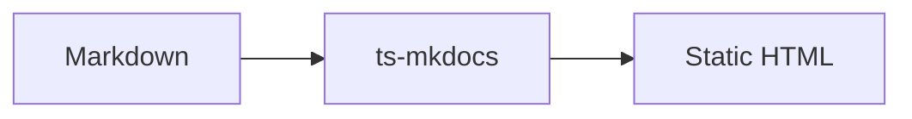

# Code Blocks

Fenced code blocks use **Shiki** for syntax highlighting. Theme features add copy buttons, line numbers, and language badges.

## Configuration

```yaml
markdown_extensions:
  - pymdownx.superfences

theme:
  highlight:
    theme_light: catppuccin-latte
    theme_dark: github-dark
  features:
    - content.code.copy
    - content.code.linenumbers
    - content.code.lang
    - content.code.wrap
```

## Basic syntax

Wrap code in triple backticks with an optional language identifier:

````markdown
```typescript
const greeting = 'hello'
console.log(greeting)
```
````

## Rendered output

```typescript
interface DocFile {
  srcPath: string
  destPath: string
  url: string
}

async function buildPage(file: DocFile): Promise<string> {
  const markdown = await fs.readFile(file.srcPath, 'utf-8')
  return renderMarkdown(markdown)
}
```

## Extended syntax

### Other languages

```python
def load_config(path: str) -> dict:
    with open(path) as f:
        return yaml.safe_load(f)
```

```bash
pnpm install
pnpm build
pnpm example:serve
```

```json
{
  "site_name": "My Docs",
  "theme": { "name": "material" }
}
```

### Plain text (no language)

```
No highlighting when the language is omitted or unknown.
```

### Code block title

Add a centered title in the code block head with `title="..."` on the fence info line:

````markdown
```typescript title="src/build.ts"
async function buildPage(file: DocFile): Promise<string> {
  return renderMarkdown(markdown)
}
```
````

Rendered output:

```typescript title="src/build.ts"
async function buildPage(file: DocFile): Promise<string> {
  const markdown = await fs.readFile(file.srcPath, 'utf-8')
  return renderMarkdown(markdown)
}
```

With `content.code.lang` enabled, the title appears centered and the language label stays on the left.

You can also set the title with `attr_list` on the opening fence:

````markdown
``` { .typescript title="greeting.ts" }
const greeting = 'hello'
```
````

## Advanced usage

### Blank lines inside blocks

Blank lines are preserved and should not overlap adjacent lines when line numbers are enabled:

```typescript
function example() {
  const a = 1

  const b = 2
  return a + b
}
```

### Mermaid diagrams

Use the `mermaid` language for diagram fences (rendered client-side):



## Theme features in action

When the example theme features are on, each block above should show:

| Feature | What you see |
|---------|----------------|
| `content.code.lang` | Language label in the top bar |
| Code block `title="..."` | Centered title in the top bar |
| `content.code.copy` | Copy button on hover |
| `content.code.wrap` | Line wrap toggle in the top bar |
| `content.code.linenumbers` | Gutter line numbers |

## Combining with other syntax

Code inside tabs — see [Content Tabs](../advanced/tabs.md):

=== "TypeScript"

    ```typescript
    export function build(): void {}
    ```

=== "Python"

    ```python
    def build() -> None:
        pass
    ```

Code inside admonitions:

!!! example "Config snippet"
    ```yaml
    site_name: My Docs
    ```

Inline `` `code` `` in prose is separate from fenced blocks — see [Text & Links](../basic/text.md).
